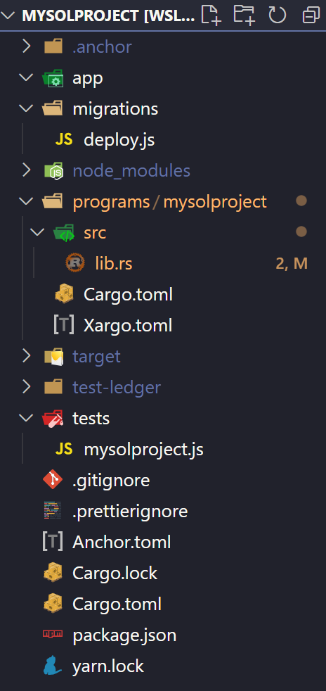

# Looking into other Rust Chains Smart Contracts

## Solana

### Basics

This is the simplest hello world contract:

```rs
use anchor_lang::prelude::*;

declare_id!("Fg6PaFpoGXkYsidMpWTK6W2BeZ7FEfcYkg476zPFsLnS");

#[program]
pub mod mysolproject {
    use super::*;

    pub fn initialize(ctx: Context<Initialize>) -> Result<()> {
        Ok(())
    }
}

#[derive(Accounts)]
pub struct Initialize {}
```

We can note that they derive their contracts from a `pub mod`, pretty much as we are already doing.

And this is their base `Cargo.toml` definition:

```toml
[package]
name = "mysolproject"
version = "0.1.0"
description = "Created with Anchor"
edition = "2021"

[lib]
crate-type = ["cdylib", "lib"]
name = "mysolproject"

[features]
no-entrypoint = []
no-idl = []
no-log-ix-name = []
cpi = ["no-entrypoint"]
default = []

[dependencies]
anchor-lang = "0.25.0"
```

The only dependency is on the `anchor-lang` lib.

The expanded contract code can be seen here: [sol-expanded.rs](./sol-expanded.rs)

### Boilerplate, Tooling and Testing

They offer a tool called `anchor` which is a nodejs cmd app that knows how to talk with solana nodes and offers devs handy commands to run deploy scripts, run tests and such. It's pretty much what Hardhat is for ETH world.

This is the boilerplate generated by anchor when you init a project using `anchor init mysolproject`:



The testing code is wrapped with `mocha` and this is the basic code:

```js
const anchor = require("@project-serum/anchor");

describe("mysolproject", () => {
  // Configure the client to use the local cluster.
  anchor.setProvider(anchor.AnchorProvider.env());

  it("Is initialized!", async () => {
    // Add your test here.
    const program = anchor.workspace.Mysolproject;
    const tx = await program.methods.initialize().rpc();
    console.log("Your transaction signature", tx);
  });
});
```

First, we tell Anchor to set our provider. It gets this data from `solana config get`. It's grabbing our local environment and it knows to run our code locally.

Anchor knows to look at `./programs/mysolproject/src/lib.rs` because of `anchor.workspace.Mysolproject`.

Then it knows how to compile the contract and get it deployed locally on a local node.

Finally, the contract function is called with `program.methods.initialize().rpc()` and the test can process the result.

## Complex Examples

- [Swap DEX](https://github.com/project-serum/swap/blob/master/programs/swap/src/lib.rs): this is an example of contract that perform instantly settled token swaps on the Serum DEX; it uses the `anchor-lang` lib and it's just a single long file with a few methods.

- [Serum DEX](https://github.com/project-serum/serum-dex/blob/master/dex/src/lib.rs): this is the full Serum DEX code, it uses the raw `solana_program`. It has multiple files and you can see how they manually implement the [dispatch function here](https://github.com/project-serum/serum-dex/blob/master/dex/src/state.rs#L2556).
